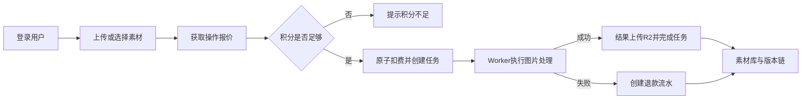

# 00 整改总纲与开发路线

> 状态：P0 需求已冻结  
> 基线版本：`P0-v1`  
> 冻结日期：2026-09-08  
> 适用范围：首发版本；后续变更按第 15 节执行。

## 1. 当前基线

当前系统是 React + FastAPI 单体应用，具备 AI 生成/编辑、智能抠图、2x/4x 放大、颜色处理、矢量化、历史版本和页面配置。生产化前存在以下结构性缺口：

- 无登录，资产、任务和配置没有用户边界。
- SQLite 与本地文件不适合多实例和云端横向扩容。
- 图片处理运行在 Web 进程内，重启会中断任务。
- 无积分账本、计价快照和失败退款机制。
- `/api/settings` 面向普通页面，缺少管理员权限和密钥加密。
- 无审计、限流、监控、备份和数据迁移流程。

## 2. 产品角色与会员关系

| 类型 | 代码/名称 | 目标 |
|---|---|---|
| 访问状态 | 游客 | 登录、找回密码；注册入口只在开放注册启用时出现，不能访问工作台数据 |
| 基础角色 | `user` | 使用图片工具，只能查看和管理自己的素材、任务、积分与资料 |
| 会员状态 | Free / Basic / Pro | 获得配额、折扣和保留期权益，不获得任何后台权限 |
| 后台角色 | `operator` | 管理用户、任务和资产，仅读取会员、积分和价格信息 |
| 后台角色 | `finance` | 管理会员、积分和价格，仅读取用户与任务信息 |
| 后台角色 | `auditor` | 只读查看运营数据、配置掩码、安全事件与审计记录 |
| 后台角色 | `super_admin` | 管理配置、角色和系统状态，并拥有全部后台权限 |

会员等级描述商业权益，角色描述操作权限，两者不得合并成一个字段。后台角色是附加角色；后台人员仍通过 `user` 角色使用自己的工作台。任何角色（包括 `super_admin`）都不能读取密钥明文。

## 3. 核心业务流程



## 4. 开发周期与先后顺序

| 阶段 | 建议工期 | 主要交付 | 前置条件 |
|---|---:|---|---|
| P0 需求冻结 | 2-3 天 | 权限矩阵、积分规则、数据保留策略、UI 信息架构 | 无 |
| P1 工程底座 | 4-6 天 | PostgreSQL、Alembic、Redis、Worker、统一错误与日志 | P0 |
| P2 身份权限 | 5-7 天 | 登录、会话、RBAC、首个管理员、资源归属中间件 | P1 |
| P3 会员积分 | 5-7 天 | 会员套餐、积分账户、流水、人工调整、并发测试 | P2 |
| P4 任务计费 | 5-7 天 | 操作价格、报价、扣费、异步任务、退款、幂等 | P3 |
| P5 R2 存储 | 4-6 天 | 私有桶、资产元数据、签名访问、迁移工具 | P1、P2 |
| P6 配置后台 | 4-5 天 | Sub2API/R2/邮件配置、加密、测试、版本发布 | P2、P5 |
| P7 管理后台 | 5-8 天 | 用户、会员、积分、任务、价格、配置、审计页面 | P3-P6 |
| P8 用户端改版 | 5-8 天 | 登录页、工作台、素材、任务、积分与会员页面 | P2-P6 |
| P9 安全与测试 | 4-6 天 | 权限、账务、限流、E2E、压测、故障注入 | 全部 |
| P10 迁移上线 | 2-4 天 | 数据迁移、灰度、监控、备份、回滚演练 | P9 |

单名全栈工程师合理周期约 7-10 周；多人并行时，P3/P5 和 P7/P8 可并行，但 P1、P2、积分账务及上线验收不能压缩跳过。

## 5. 功能优先级

### P0 必须上线

- 登录、退出、会话吊销、密码修改。
- 用户/管理员资源隔离与 RBAC。
- 会员等级及人工分配。
- 积分余额、不可变流水、操作扣费、失败退款。
- 异步任务队列、幂等和任务取消规则。
- R2 私有存储与短时授权访问。
- 管理员配置 Sub2API、R2 和邮件服务。
- 管理后台、审计、监控、备份和恢复。

### P1 上线后迭代

- 邮箱验证码、邀请注册、积分兑换码。
- 会员自动续期、积分定期发放。
- 运营报表、成本和毛利统计。
- 批量任务与批量下载。

### P2 暂不实现

- 在线支付与自动退款到支付渠道。
- 团队/组织、多租户空间。
- 对外开放 API 和第三方 OAuth。

## 6. 全局权限原则

- 所有 `/api/v1/admin/**` 必须由后台权限点授权，前端隐藏菜单不是权限控制。
- 所有资产、任务、版本、下载接口都必须执行 `owner_id` 校验。
- `super_admin` 也不能读取密钥明文；只能覆盖、停用和测试。
- 管理员人工改会员、改积分、停用户和改价格必须填写原因并写审计。

## 7. 全局数据原则

- 主键统一使用 UUIDv7，时间统一存 UTC，金额/积分使用整数。
- 业务数据采用软删除；积分流水和审计日志禁止删除。
- 所有状态字段使用受控枚举并由后端执行状态迁移。
- PostgreSQL 是业务事实源，R2 是对象事实源，Redis 只保存可重建状态。

## 8. 全局接口原则

- 新接口前缀统一为 `/api/v1`；旧接口在迁移期保留适配层。
- 写接口接受 `Idempotency-Key`，任务创建与积分调整必须强制提供。
- 错误统一为 `{code, message, request_id, details}`。
- 列表使用游标分页：`?cursor=&limit=20`。
- 管理接口返回的数据默认脱敏，并写入 `audit_logs`。

## 9. 上线验收门槛

- 任意用户无法读取、下载或处理其他用户资产。
- 100 个并发相同请求只能创建一个任务并扣一次积分。
- 任务失败、超时或 Worker 崩溃后积分最多退款一次。
- R2 对象没有永久公开 URL，签名 URL 过期后不可访问。
- 配置接口、日志和审计记录中不出现密钥明文。
- PostgreSQL 和 R2 均完成恢复演练，RPO 不超过 24 小时，RTO 不超过 4 小时。
- 核心流程 E2E、权限矩阵和积分并发测试全部通过后才能上线。

## 10. 已冻结的首发产品决策

| 决策项 | `P0-v1` 冻结结论 | 实现约束 |
|---|---|---|
| 注册方式 | 首发仅管理员创建账号，开放注册关闭 | 保留 `registration_mode` 配置项；开放注册在邮箱验证与滥用防护完成后启用 |
| 默认会员 | Free，长期有效，1 个并发任务 | 用户首次激活时自动分配，角色变化不得改变会员 |
| 新用户积分 | 首次激活赠送 20 分 | 后台可配置；按用户唯一业务键发放，禁用后重新启用不得重复赠送 |
| 会员等级 | Free / Basic / Pro 三档 | 使用第 12.1 节的首发权益种子，后续修改必须版本化 |
| 积分有效期 | 首发不过期 | 未来增加积分批次实现过期，不改变现有流水语义 |
| 在线支付 | 首发不接 | 会员与积分只允许管理员人工操作，不展示购买、续费或支付入口 |
| 素材保留期 | Free 30 天、Basic 60 天、Pro 90 天 | 创建资产时写入权益快照与明确的 `retention_until` |
| 失败扣费 | 最终失败、超时和排队取消全额退款 | 同一任务最多产生一次退款；运行中默认不可取消 |
| 管理员调整 | 绝对值小于 1000 分可单人执行，达到 1000 分需双人审批 | 阈值可配置；申请人与审批人必须不同，所有操作填写原因并审计 |
| 登录标识 | 邮箱必填，用户名可选 | 邮箱和用户名均不区分大小写；登录错误不得暴露账号是否存在 |

以上数值是首发配置种子，不得作为散落在业务代码中的常量。会员权益、操作价格、赠送积分和审批阈值必须由数据库配置或受控系统配置提供。

## 11. P0 权限基线

### 11.1 用户自身权限

所有已激活账号默认拥有 `user` 角色，包含以下权限：

```text
studio.use
assets.read_own / assets.write_own / assets.delete_own
tasks.read_own / tasks.create / tasks.cancel_own
points.read_own
membership.read_own
```

自身权限始终叠加 `owner_id = current_user.id` 约束，不能通过请求中的 `user_id`、资产 ID 或任务 ID 绕过。`tasks.cancel_own` 只允许取消排队任务；`assets.delete_own` 不允许删除仍被运行任务依赖的资产。

### 11.2 后台角色权限

`—` 表示不授予。角色权限取并集，但资源归属、密钥不可读和高风险审批规则不能被角色组合绕过。

| 权限点 | operator | finance | auditor | super_admin |
|---|---:|---:|---:|---:|
| `admin.dashboard.read` | 是 | 是 | 是 | 是 |
| `users.read` | 是 | 是 | 是 | 是 |
| `users.manage` | 是 | — | — | 是 |
| `roles.read` | — | — | 是 | 是 |
| `roles.manage` | — | — | — | 是 |
| `memberships.read` | 是 | 是 | 是 | 是 |
| `memberships.manage` | — | 是 | — | 是 |
| `points.read` | 是 | 是 | 是 | 是 |
| `points.adjust` | — | 是 | — | 是 |
| `pricing.read` | 是 | 是 | 是 | 是 |
| `pricing.manage` | — | 是 | — | 是 |
| `tasks.read` | 是 | 是 | 是 | 是 |
| `tasks.manage` | 是 | — | — | 是 |
| `assets.read` | 是 | — | 是 | 是 |
| `assets.manage` | 是 | — | — | 是 |
| `config.read` | — | — | 是 | 是 |
| `config.manage` / `config.test` | — | — | — | 是 |
| `audit.read` | — | — | 是 | 是 |
| `audit.export` | — | — | — | 是 |
| `security.events.read` | — | — | 是 | 是 |
| `security.policies.manage` | — | — | — | 是 |
| `system.health.read` | 是 | — | 是 | 是 |
| `system.diagnostics.read` | — | — | — | 是 |
| `system.maintenance.execute` | — | — | — | 是 |

所有 `/api/v1/admin/**` 请求必须同时满足会话有效、账号为 `active` 和所需权限点。管理员跨用户预览或下载资产必须记录 `admin_preview`/`admin_download` 审计；任何配置读取只返回配置状态、掩码和版本信息。

## 12. P0 会员与积分规则

### 12.1 会员权益种子

| 套餐 | 操作折扣 | 并发任务 | 单文件上限 | 图片像素上限 | 素材保留 | 周期赠送 |
|---|---:|---:|---:|---:|---:|---:|
| Free | 100% | 1 | 20 MB | 40 MP | 30 天 | 0 |
| Basic | 95% | 2 | 30 MB | 60 MP | 60 天 | 0 |
| Pro | 85% | 3 | 40 MB | 80 MP | 90 天 | 0 |

- 首发不自动续期、不自动发放周期积分；`periodic_points` 字段保留为 0，定期发放属于 P1。
- Basic/Pro 由管理员设置明确的生效与到期时间。降级默认在周期结束生效，立即变更必须填写原因。
- 操作自身的格式、尺寸和引擎限制优先于会员上限。会员权益不能绕过系统安全上限。
- 任务创建时保存会员与折扣快照；任务执行期间的会员变化不重算价格。

### 12.2 首发操作价格

| 操作代码 | 积分 |
|---|---:|
| `ai.generate` | 20 |
| `ai.redraw` | 18 |
| `ai.repair` | 15 |
| `ai.text_fix` | 15 |
| `ai.variant` | 18 |
| `cutout.smart` | 2 |
| `upscale.2x` | 2 |
| `upscale.4x` | 6 |
| `color.effect` | 1 |
| `vectorize.svg` | 3 |

上传、图片预检、素材浏览、下载、比较视图和抠图背景预览不扣积分。最终价格采用 `max(0, ceil(基础积分 × 折扣基点 / 10000) + 参数加价)`；报价 5 分钟内有效，提交按报价快照扣费。

### 12.3 账务与退款规则

- 首次激活赠送使用 `reference_type=onboarding`、用户 ID 作为业务引用，并同时受幂等键与业务唯一约束保护。
- 扣费、流水和任务创建必须在同一个 PostgreSQL 事务中完成；余额不足时三者均不得写入。
- Worker 内部重试沿用原任务和原扣费，不再次报价或扣费。用户对已结束任务发起新任务时重新报价并扣费。
- 排队取消、最终失败或超时均创建全额反向流水；迟到的 Worker 结果不得覆盖退款后的终态。
- 成功任务不自动退款。业务争议由管理员通过调整或冲正处理，不能修改或删除原流水。
- 人工调整按 `abs(amount)` 判断审批阈值；达到 1000 分时由另一名具有 `points.adjust` 的管理员审批，申请人不得自批。

## 13. P0 数据保留策略

| 数据 | 在线保留 | 到期处理 |
|---|---|---|
| R2 原图、结果、遮罩、缩略图、SVG | 按资产创建时 Free 30 / Basic 60 / Pro 90 天快照 | 到期软删除，7 天宽限期后进入物理删除队列 |
| 用户主动删除的资产 | 立即不可见 | 7 天后物理删除；宽限期内仅 `assets.manage` 可恢复 |
| 任务、报价和计价快照 | 2 年 | 匿名化可识别字段后转冷数据；保留账务所需引用与摘要 |
| 积分账户与流水 | 不删除 | 账号删除后匿名化用户信息，流水和余额快照保持不可变 |
| 审计日志 | 在线 180 天，之后归档 | 加密归档长期保留；禁止应用角色更新或删除原记录 |
| 登录尝试与限流明细 | 90 天 | 自动删除；只存带服务端 salt 的 IP 哈希 |
| 已过期/吊销会话 | 30 天 | 自动删除令牌哈希和设备明细 |
| 已过期/已使用密码重置令牌 | 7 天 | 自动删除 |
| 站内通知 | 180 天 | 自动删除，审计和账务事实不随通知删除 |
| 配置版本与管理员操作申请 | 2 年 | 脱敏归档，密钥密文不进入审计副本 |

资产创建后会员升级或降级不追溯修改已有 `retention_until`，新资产使用变更后的权益。到期前 7 天和 1 天创建站内通知；邮件仅在服务已配置且用户允许时发送。根资产进入删除流程时，其派生版本、遮罩和缩略图必须作为同一版本链处理，不能留下孤儿对象。

账号删除采用“立即禁用并吊销会话、30 天冷静期、到期匿名化”的流程。冷静期内不再创建任务，资产按删除队列处理；到期后邮箱、用户名、显示名和设备信息不可恢复地匿名化，只保留账务、审计和安全所需的伪名化主体 ID。该基线在生产上线前仍需按实际运营地区完成合规复核。

## 14. P0 UI 信息架构

### 14.1 路由与导航

```text
/                              按会话重定向到 /app 或 /login
/login                         登录
/forgot-password               找回密码（邮件服务未配置时隐藏入口）
/reset-password                一次性链接设置/重置密码

/app                           工作台概览
/app/studio                    图片编辑器
/app/assets                    素材库与版本
/app/jobs                      任务中心
/app/points                    积分余额与流水
/app/membership                会员与权益
/app/profile                   个人资料、安全与设备

/admin                         管理总览
/admin/users                   用户
/admin/memberships             会员
/admin/points                  积分
/admin/pricing                 价格
/admin/jobs                    任务
/admin/assets                  资产
/admin/settings                系统配置
/admin/roles                   角色权限
/admin/audit                   审计与安全事件
```

首发不提供公开 `/register` 页面。后台入口仅在用户拥有至少一个后台权限时出现；具体菜单继续按第 11.2 节权限过滤。前端路由守卫只负责体验，后端仍须逐请求鉴权。

### 14.2 核心页面流程

1. 登录后加载 `/api/v1/app/bootstrap`，统一获得脱敏用户、权限、会员、积分、运行任务和服务状态。
2. 用户上传或选择本人素材，在编辑器选择操作并获取报价；确认框同时展示原价、折扣、最终积分、当前余额和报价有效期。
3. 提交后立即进入任务中心跟踪排队、运行、重试、成功、失败和退款，离开编辑器不得中断任务。
4. 成功结果自动进入素材版本链；下载前重新校验权限并获取短时地址。
5. 管理后台使用独立布局，采用紧凑表格、筛选、详情抽屉和审计时间线，不与图片编辑器混排。

桌面端采用左侧主导航、中间工作区、右侧参数/结果区；平板将参数区移动到画布下方；手机使用顶部紧凑导航和底部操作区。所有页面必须覆盖加载、空数据、校验错误、网络错误、401、403、维护、积分不足、任务排队和移动端状态。

## 15. P0 完成判定与变更控制

本文件完成以下 P0 交付：

- [x] 首发范围、阶段依赖与不上线范围已冻结。
- [x] 产品角色、会员等级及其相互独立关系已冻结。
- [x] 内置角色权限矩阵与资源归属原则已冻结。
- [x] 会员权益、初始价格、赠送、扣费、退款和审批规则已冻结。
- [x] 资产、账号、安全、账务和审计数据保留策略已冻结。
- [x] 用户端与管理端信息架构、路由和核心流程已冻结。
- [x] 上线质量门槛已定义，可由文档 12 转换为自动化验收项。

变更规则：

- `P0-v1` 是后续文档 01-13 的产品输入；出现冲突时先按本文件执行，再通过评审修订本文件和受影响的领域文档。
- 权限代码、账务语义、退款条件、数据保留和首发范围的变更必须形成版本化决策记录，并同时更新迁移、测试与审计要求。
- 价格、权益数值、赠送积分、审批阈值和注册模式属于受控配置；修改只影响新业务快照，不回写历史任务、流水或会员事件。
- 在完成文档 01 的工程底座前，不实现依赖 PostgreSQL 事务、Redis、Worker 或 R2 的上层功能。
