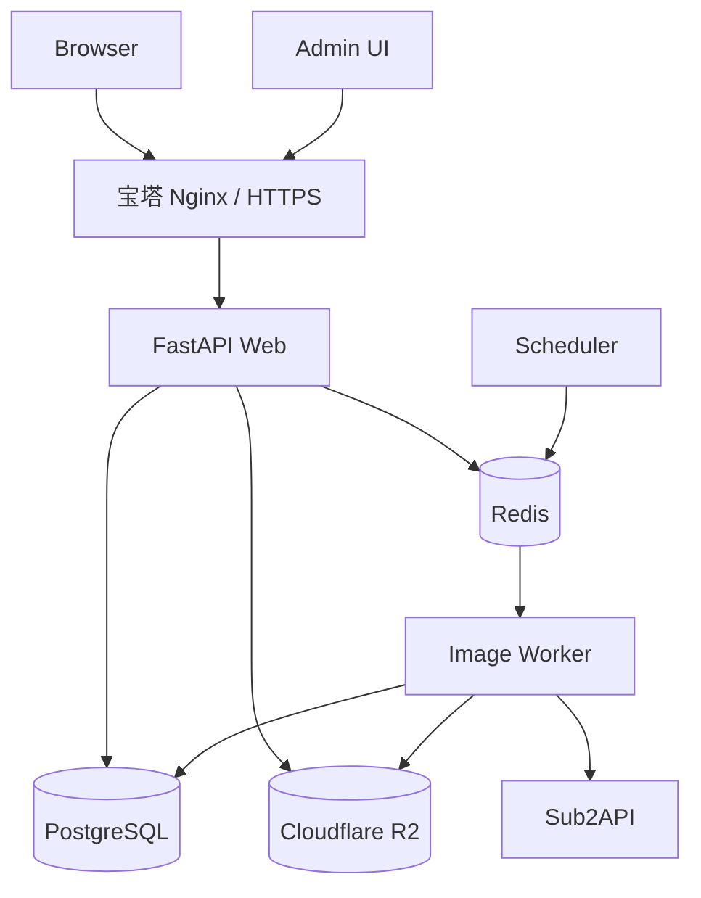

# 01 生产架构与工程基础

> 状态：已执行  
> 完成日期：2026-09-08  
> 实现基线：`0.2.0`

## 1. 功能目标

把当前单进程应用改造成可恢复、可观测、可横向扩展的生产架构，同时保留 React、FastAPI 和现有图片算法。



### 服务划分

- `web`：认证、授权、报价、任务创建、管理接口、签名下载。
- `worker`：AI 调用、本地抠图、放大、颜色处理、矢量化、R2 上传。
- `scheduler`：任务超时补偿、会员积分发放、对象清理、健康巡检。
- `postgres`：用户、权限、会员、积分、任务、资产、配置、审计。
- `redis`：任务队列、短期缓存、分布式锁、限流计数；丢失后可重建。
- `r2`：私有图片对象和派生文件。

推荐异步栈为 FastAPI + SQLAlchemy 2 + Alembic + PostgreSQL 16 + Redis 7 + ARQ。ARQ 与现有异步 Python 代码匹配；若团队已有 Celery 运维经验，可替换但不能同时维护两套任务框架。

## 2. 权限要求

| 能力 | 权限点 |
|---|---|
| 查看服务健康摘要 | `system.health.read` |
| 查看详细依赖状态 | `system.diagnostics.read` |
| 执行迁移/维护任务 | `system.maintenance.execute` |
| 查看队列与 Worker | `tasks.monitor` |

公开健康检查只返回 `ok/degraded`，不得暴露数据库地址、R2 桶名、版本密钥或异常堆栈。

## 3. 数据库结构

本阶段先建立所有模块共享字段和迁移机制：

```text
schema_migrations
- version varchar PK
- applied_at timestamptz

service_instances
- id uuid PK
- service_type varchar             # web/worker/scheduler
- instance_name varchar
- version varchar
- last_heartbeat_at timestamptz
- metadata jsonb

outbox_events
- id uuid PK
- topic varchar
- aggregate_type varchar
- aggregate_id uuid
- payload jsonb
- status varchar                   # pending/published/failed
- attempts int
- available_at timestamptz
- created_at timestamptz
```

业务表统一包含适用字段：`id`、`created_at`、`updated_at`、`version`。需要软删除的表增加 `deleted_at`；不可变账务/审计表不提供 `updated_at` 和删除能力。

## 4. 接口设计

```text
GET  /api/health                    # 负载均衡探活，公开且信息最少
GET  /api/v1/system/status          # 登录用户可见的功能状态
GET  /api/v1/admin/system/health    # 数据库、Redis、R2、Worker、Sub2API 摘要
GET  /api/v1/admin/system/workers   # Worker 心跳和版本
POST /api/v1/admin/system/jobs/reconcile
```

所有响应附带 `X-Request-ID`。后台慢操作只创建维护任务，不允许 HTTP 请求长时间阻塞。

## 5. 工程整改

- 将后端拆为 `api/domain/repositories/services/workers`，图片算法保留在独立 `image_ops`。
- 引入 Alembic，禁止应用启动时隐式修改生产表。
- 配置分为启动配置和管理员业务配置，见 08 文档。
- 日志统一 JSON，字段至少包含 `request_id/user_id/job_id/operation/duration_ms/status`。
- Web 与 Worker 使用相同镜像、不同启动命令；镜像内不写运行数据。
- Docker Compose 生产版仅将 Nginx 暴露公网，PostgreSQL、Redis、Web 端口使用内部网络。

## 6. 非功能要求

- API 非图片处理请求 P95 小于 300 ms。
- Web 实例重启不丢已创建任务，Worker 重启可重试未完成任务。
- 每个 Worker 默认只并行 1-2 个高内存图片任务，并按服务器资源调整。
- 单文件、像素、任务时长和用户并发都有硬限制。
- 优雅停机：停止接新任务，当前任务完成或回队后退出。

## 7. 验收标准

- Web、Worker、Scheduler 可独立启动和滚动重启。
- Redis 清空后，用户、积分、任务和资产事实不丢失。
- 数据库迁移可在空库和当前生产快照上重复验证。
- 任何图片计算都不在 Web 请求进程中长期执行。

## 8. 实施结果

- [x] 引入 SQLAlchemy 2、asyncpg 与 Alembic，建立显式迁移入口和首个共享表迁移。
- [x] 建立 `api/domain/repositories/services/workers` 分层，保留独立 `image_ops`。
- [x] Web、Worker、Scheduler 使用同一镜像和不同命令，可分别启动与停止。
- [x] ARQ Worker 默认最多并行 2 个任务，支持信号停机和最长 15 分钟容器宽限期。
- [x] 服务实例向 PostgreSQL 和 Redis 写心跳，详细依赖状态位于受权限保护的管理接口。
- [x] 所有 API 响应附带 `X-Request-ID`，错误统一为 `{code,message,request_id,details}`。
- [x] 应用日志为 JSON，并固定输出 `request_id/user_id/job_id/operation/duration_ms/status` 字段。
- [x] Compose 仅暴露 Nginx；PostgreSQL、Redis、Web、Worker、Scheduler 使用内部网络。
- [x] 生产配置关闭旧同步图片接口，确保 Web 不执行长期图片计算；开发配置暂时保留迁移适配层。

身份认证与 `system.*`/`tasks.monitor` 权限的真实授权在文档 02、03 实现前保持关闭。图片任务的领域状态机、计费和 R2 输入输出分别由文档 06、05、07 实现；本阶段只提供可靠运行底座，不提前定义这些领域语义。
